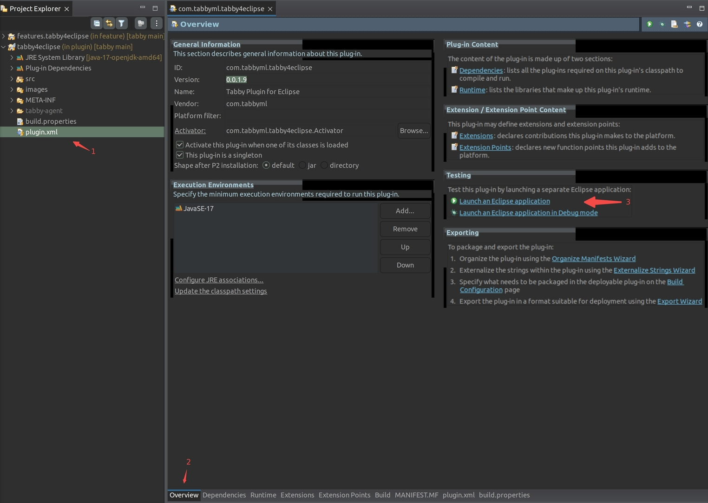
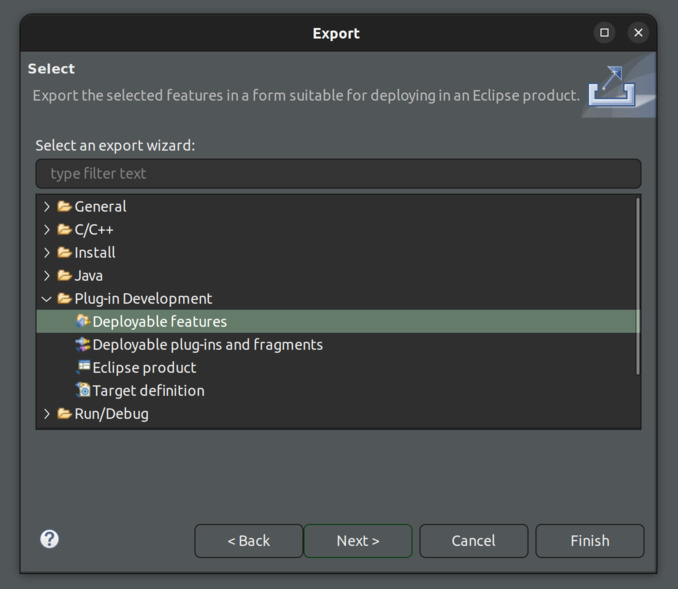
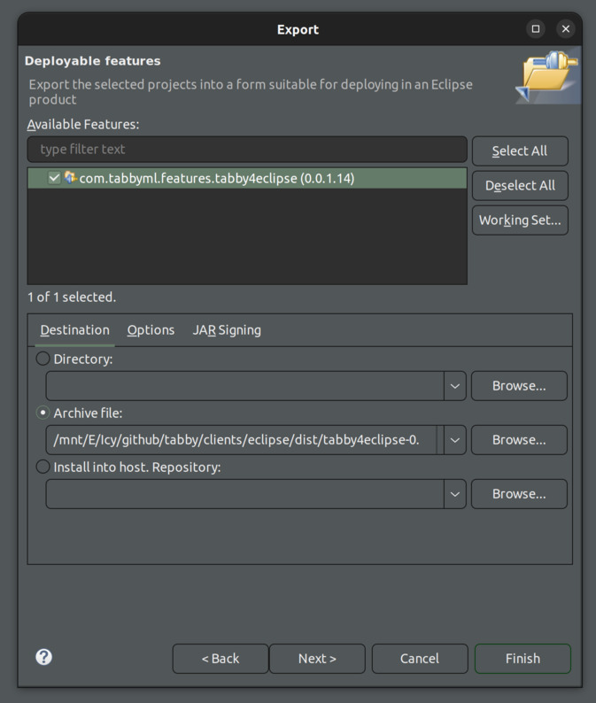

# Tabby Plugin for Eclipse

**Note:** This repository is currently undergoing extensive development.

## Development Setup

1. Install Eclipse with the [Plug-in Development Environment (PDE)](https://projects.eclipse.org/projects/eclipse.pde). It is recommended to download the [Eclipse IDE for Eclipse Committers](https://www.eclipse.org/downloads/packages/release/2024-06/r/eclipse-ide-eclipse-committers) for a more streamlined setup.

2. Ensure you have [Node.js](https://nodejs.org/en/download/) version 18 or higher installed. For package management, install [pnpm](https://pnpm.io/installation). Using [corepack](https://pnpm.io/installation#using-corepack) is the preferred method for installation.

3. Clone the Tabby repository and install its dependencies:
    ```bash
    git clone https://github.com/TabbyML/tabby.git
    cd tabby
    pnpm install
    cd clients/eclipse
    pnpm turbo build
    ```
    This process will also build the `tabby-agent` and place it into the `clients/eclipse/plugin/tabby-agent/` directory.

4. Import the project into your Eclipse workspace.  
  a. Open `File -> Import...`, select the `General -> Existing Projects into Workspace` option, and click `Next`.  
      
  b. Select the `clients/eclipse/plugin` as the root directory, check the item to be imported, and click `Finish`.  
      
  c. Then import the `clients/eclipse/feature` directory as well.  

5. Open the `clients/eclipse/plugin/plugin.xml` file in Eclipse. It should open as a plugin project overview. In the `Testing` section, click on `Launch an Eclipse application` to start the plugin.  
    

## Export a ZIP Archive

1. In Eclipse, open `File -> Export...`, select the `Plug-in Development -> Deployable features` option, and click `Next`.  
      
2. Check the `com.tabbyml.features.tabby4eclipse`, then select `Archive file` with a specified file path, and click `Finish`.
      
3. The exported ZIP archive should be located at the specified file path. It can be installed by navigating to `Help -> Install New Software...`.
