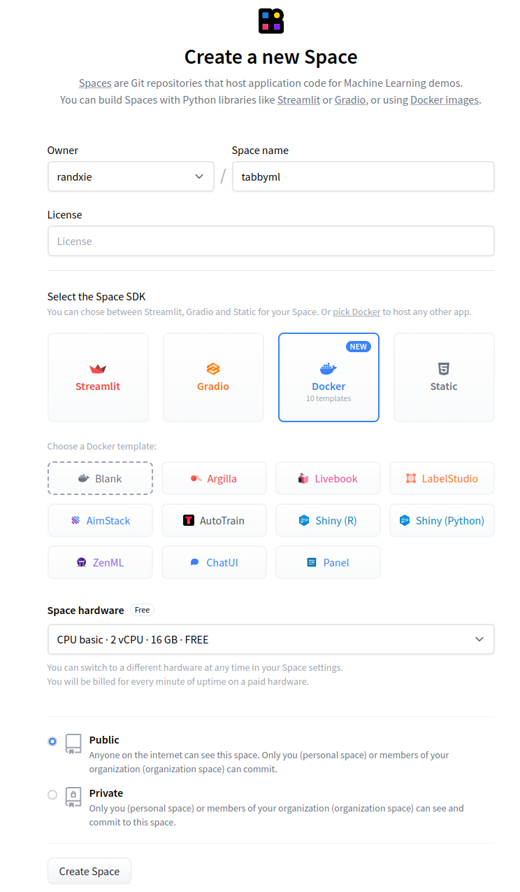
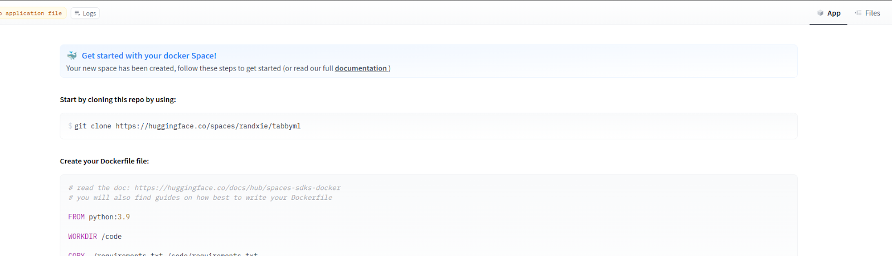
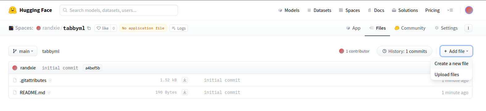
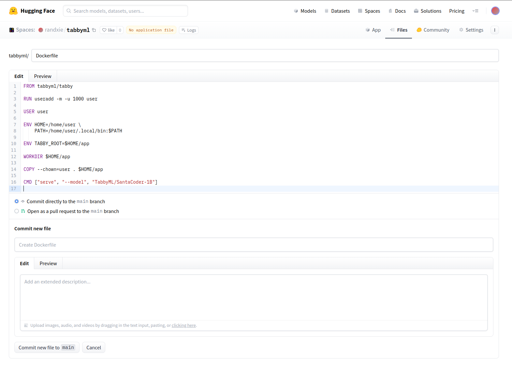
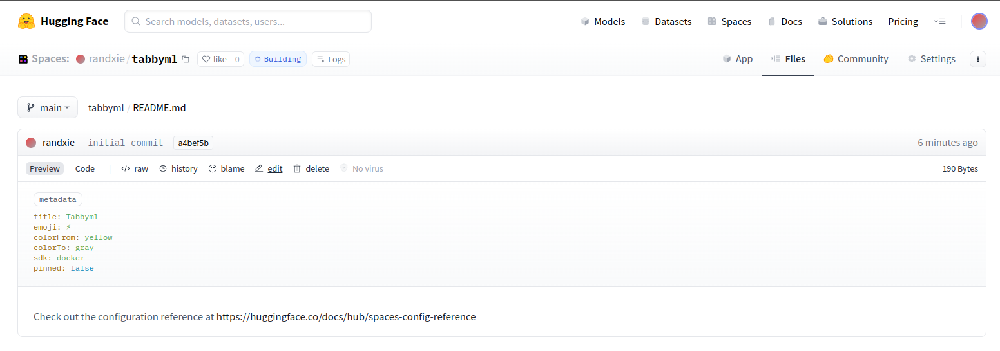
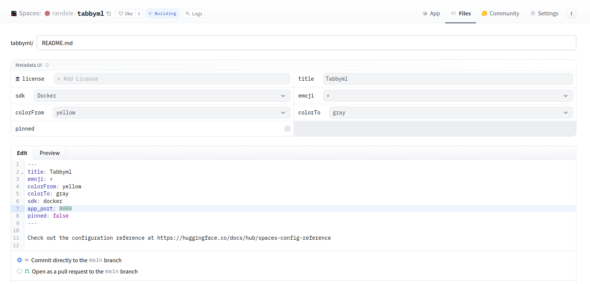
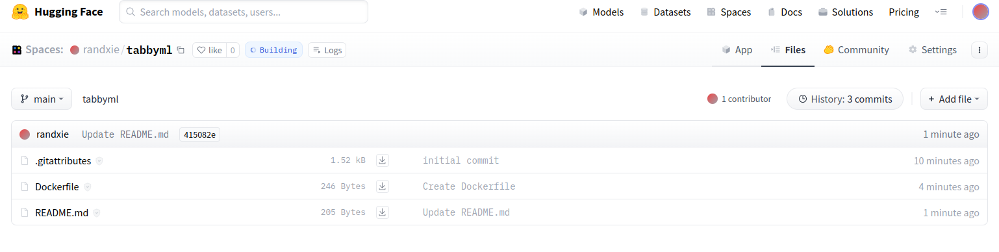
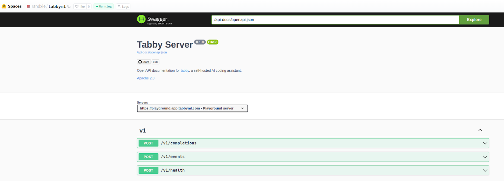
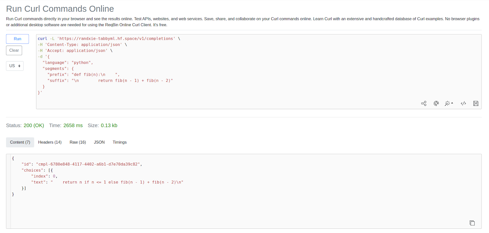

[Hugging Face Spaces](https://huggingface.co/spaces) offers an easy-to-use Nvidia GPU hosting runtime, allowing anyone to host their machine learning models or AI applications.

In this blog post, we are going to show you how to deploy a Tabby instance in Hugging Face Spaces. If you have not heard of Tabby, it’s an open-source Github Copilot alternative that supports code completion.
Check out more details [here](https://github.com/TabbyML/tabby).

### How it works

Let’s firstly take a look at what steps are needed to deploy a Tabby instance in Hugging Face. It’s super easy and you don’t need much coding knowledge. Buckle up and let’s get started.

**Step 1:** Create a new Hugging Face Space ([link](https://huggingface.co/new-space)). Spaces are code repositories that host application code.

**Step 2:** Create a Dockerfile to capture your machine learning models' logic, and bring up a server to serve requests.

**Step 3:** After space is built, you will be able to send requests to the APIs.

That's it! With the hosted APIs, now you can connect Tabby's [IDE extensions](/docs/getting-started) to the API endpoint. Next, we will deep dive into each step with screenshots!!
**Everything will be done in the Hugging Face UI. No local setup is needed.**

:::tip
Looking to quickly start a Tabby instance? You can skip the tutorials entirely and simply create space from [this template](https://huggingface.co/spaces/TabbyML/tabby-template-space?duplicate=true).
:::

### Deep Dive

#### Create a new Space

After you create a Hugging Face account, you should be able to see the following page by clicking this [link](https://huggingface.co/new-space).
The owner name will be your account name. Fill in a Space name, e.g. "tabbyml", and select Docker as Space SDK. Then click "Create Space" at the bottom.

In this walkthrough we recommend using **Nvidia T4** instance to deploying a model of ~1B parameter size.



#### Uploading Dockerfile

For advanced users, you can leverage the Git workspace. In this blog post, we will show you the UI flow instead. After you click the "Create a Space" in the last step, you will be directed to this page. Just ignore the main text and click the "Files" on the top right corner.



After clicking on the "Files", you will be able to see a "Add file" button, click that, then click on "Create a new file"



Then you will be redirected to the page below. Set the filename to “Dockerfile” and copy the content to the “Edit” input box. You can copy the code from the [appendix](#dockerfile) here to bring up the [SantaCoder-1B](https://huggingface.co/TabbyML/SantaCoder-1B) model. Once ready, click the button “Commit new file to main” on the bottom.



#### Edit Readme

You also need to add a new line the README.md. Click the "edit" button in the README.md file.




Add this line "app_port: 8080" after "sdk: docker"



Click the button "Commit to main" to save the changes.

#### Verify Tabby is running

Click on the "App" button, you should be able to see the container is building:



If the App is up successfully, you should see this page:



#### Call code completion API

Now, you are able to call the completion API. The full URL is https://{YOUR-ACCOUNT-NAME}-tabbyml.hf.space/v1/completions. In this post, the URL is https://randxie-tabbyml.hf.space/v1/completions.

To test if your APIs are up and running, use [this online tool](https://reqbin.com/curl) to send curl commands:



The complete curl command can also be located in the [appendix](#curl-command). Ensure that you have adjusted the URL to align with your Hugging Face Spaces settings!

(If you are setting the space to private, you will need to fill in your Huggingface Access Token as bearer token in HTTP Headers, like `Authorization: Bearer $HF_ACCESS_TOKEN`.)

### Conclusion
In this post, we covered the detailed steps for deploying a Tabby instance to Hugging Face Spaces. By following these steps, anyone is able to bring up their own code completion APIs easily.

### Appendix

#### Dockerfile
```Dockerfile
FROM tabbyml/tabby

USER root
RUN mkdir -p /data
RUN chown 1000 /data

USER 1000
CMD ["serve", "--device", "cuda", "--model", "TabbyML/SantaCoder-1B"]
```

#### CURL Command
```bash
curl -L 'https://randxie-tabbyml.hf.space/v1/completions' \
-H 'Content-Type: application/json' \
-H 'Accept: application/json' \
-d '{
  "language": "python",
  "segments": {
    "prefix": "def fib(n):\n    ",
    "suffix": "\n        return fib(n - 1) + fib(n - 2)"
  }
}'
```
