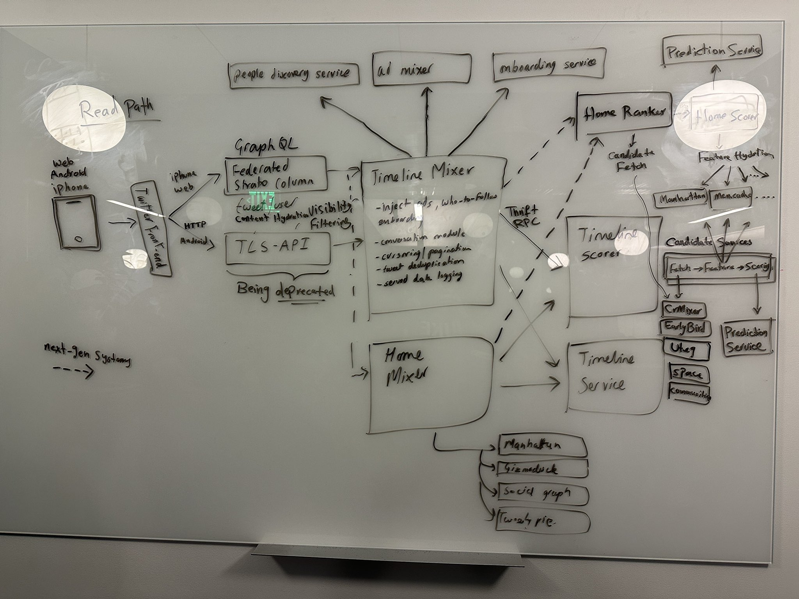

# Repository context for LLM assisted code completion

<div align="center">


*Credit: [Elon Mask's tweet](https://twitter.com/elonmusk/status/1593899029531803649)*

</div>

Using a Language Model (LLM) pretrained on coding data proves incredibly useful for "self-contained" coding tasks, like conjuring up a completely new function that operates independently 🚀.

However, employing LLM for code completion within a vast and intricate pre-existing codebase poses certain challenges 🤔. To tackle this, LLM needs to comprehend the dependencies and APIs that intricately link its subsystems. We must provide this "repository context" to LLM when requesting it to complete a snippet.

To be more specific, we should:

1. Aid LLM in understanding the overall codebase, allowing it to grasp the intricate code with dependencies and generate fresh code that utilizes existing abstractions.

2. Efficiently convey all of this "code context" in a manner that fits within the context window (~2000 tokens), keeping completion latency reasonably low.

To demonstrate the effectiveness of this approach, below is an example showcasing [TabbyML/StarCoder-1B](https://hf.co/TabbyML/StarCoder-1B) performing code completion within Tabby's own repository.

```rust title="Completion request"
start_heartbeat(args);
Server::bind(&address)
    .serve(app.into_make_service())
    .await
    .unwrap_or_else(|err| fatal!("Error happens during serving: {}", err))
}

fn api_router(args: &ServeArgs) -> Router {
    let index_server = Arc::new(IndexServer::new());
    let completion_state = {
        let (
            engine,
            EngineInfo {
                prompt_template, ..
            },
        ) = create_engine(&args.model, args);
        let engine = Arc::new(engine);
        let state = completions::CompletionState::new(
            ║
    }
```

Without access to the repository context, LLM can only complete snippets based on the current editor window, generating a wrong function call to `CompletionState::new`.

```rust title="Without repository context"
fn api_router(args: &ServeArgs) -> Router {
        ...
        let engine = Arc::new(engine);
        let state = completions::CompletionState::new(
            engine,
            prompt_template,
        );
        Arc::new(state);
        ...
}
```

However, with the repository context (Specifically, if we include the entire file of `crates/tabby/src/serve/completions.rs` into the prompt).


```rust title="Prepend to the completion request"
// === crates/tabby/serve/completions.rs ===
// ......
// ......
```

We can generate a snippet that properly calls `CompletionState::new` (with the second parameter being `index_server.clone()`).

```rust title="With repository context"
fn api_router(args: &ServeArgs) -> Router {
        ...
        let engine = Arc::new(engine);
        let state = completions::CompletionState::new(
            engine,
            index_server.clone(),
            prompt_template,
        );
        Arc::new(state);
        ...
}
```

## The Problem: Repository Context

One obvious solution is to pack the whole codebase into LLM with each completion request. Voila✨! LLM has all the context it needs! But alas, this approach falls short for even moderately sized repositories. They're simply too massive to squeeze into the context window, causing a slowdown in inference speed.

A more efficient approach is to be selective, hand-picking the snippets to send. For instance, in the example above, we send the file containing the declaration of the `CompletionState::new` method. This strategy works like a charm, as illustrated in the example.

However, manually pinpointing the right set of context to transmit to LLM isn't ideal.
Plus, sending entire files is a bulky way to relay code context, wasting the precious context window. LLM doesn't need a grand tour of the complete `completion.rs`, only a robust enough understanding to utilize it effectively.
If you continually dispatch multiple files' worth of code just for context, you'll soon hit a wall with the context window limit.

## Code snippet to provide context.

In the [v0.3.0 release](https://github.com/TabbyML/tabby/releases/tag/v0.3.0), we introduced Retrieval Augmented Code Completion, a nifty feature that taps into the repository context to enhance code suggestions. Here's a sneak peek of a snippet we pulled from the repository context:

```rust title="Snippet from the Repository Context: A Glimpse into the Magic"
// Path: crates/tabby/src/serve/completions.rs
// impl CompletionState {
//     pub fn new(
//         engine: Arc<Box<dyn TextGeneration>>,
//         index_server: Arc<IndexServer>,
//         prompt_template: Option<String>,
//     ) -> Self {
//         Self {
//             engine,
//             prompt_builder: prompt::PromptBuilder::new(prompt_template, Some(index_server)),
//         }
//     }
// }
//
// Path: crates/tabby/src/serve/mod.rs
// Router::new()
//         .merge(api_router(args))
```

By snagging snippets like this, LLM gets to peek into variables, classes, methods, and function signatures scattered throughout the repo. This context allows LLM to tackle a multitude of tasks. For instance, it can cleverly decipher how to utilize APIs exported from a module, all thanks to the snippet defining / invoking that API.

## Use tree-sitter to create snippets

Tabby, under the hood, leverages 🌳 Tree-sitter query to construct its index. Tree-sitter is capable of scanning source code written in various languages and extracting data about all the symbols defined in each file.

Historically, Tree-sitter was utilized by IDEs or code editors to facilitate the creation of language formatters or syntax highlighters, among other things. However, we're taking a different approach and using Tree-sitter to aid LLM in understanding the codebase.

Here's an example of the output you'll get when you run following query on go source code:

```scheme title="Tree-sitter query to collect all type definitions"
(type_declaration (type_spec name: (type_identifier) @name)) @definition.type
```

```go title="Snippets captured by the above query"
type payload struct {
	Data string `json:"data"`
}
...
```

These snippets are then compiled into an efficient token reverse index for use during querying. For each request, we tokenize the text segments and perform a BM25 search in the repository to find relevant snippets. We format these snippets in the line comment style, as illustrated in the example above. This format ensures it doesn't disrupt the existing semantics of the code, making it easy for LLM to understand. 

## Roadmap

The current approach to extracting snippets and performing ranking is relatively simple. We're actively working on various aspects to fully iterate through this approach and elevate its efficiency and effectiveness:

1. **Snippet Indexing**: We are aiming to achieve a detailed understanding of what snippets should be incorporated into the index for each programming language. 📚

2. **Retrieval Algorithm**: Our focus is on refining the retrieval algorithm using attention weight heatmaps. Ideally, snippets with higher attention weights from Language Models (LLMs) should be prioritized in the retrieval process. ⚙️

We are incredibly enthusiastic about the potential for enhancing the quality and are eager to delve deeper into this exciting development! 🌟

## Give it a try
To use this repository context feature:

1. Installing [tabby](/docs/installation/).
2. Navigate to the [Configuration](/docs/configuration#repository-context-for-code-completion) page and set up your `~/.tabby/config.toml`
3. Finally, run `tabby scheduler` to build an index and unlock the full potential of this innovative feature! 🛠️
