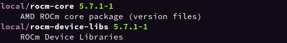
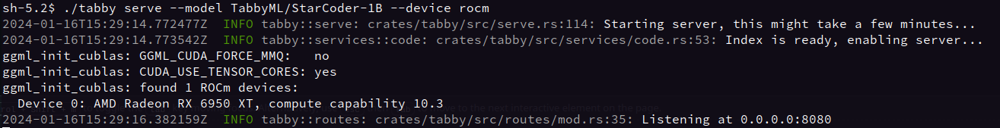
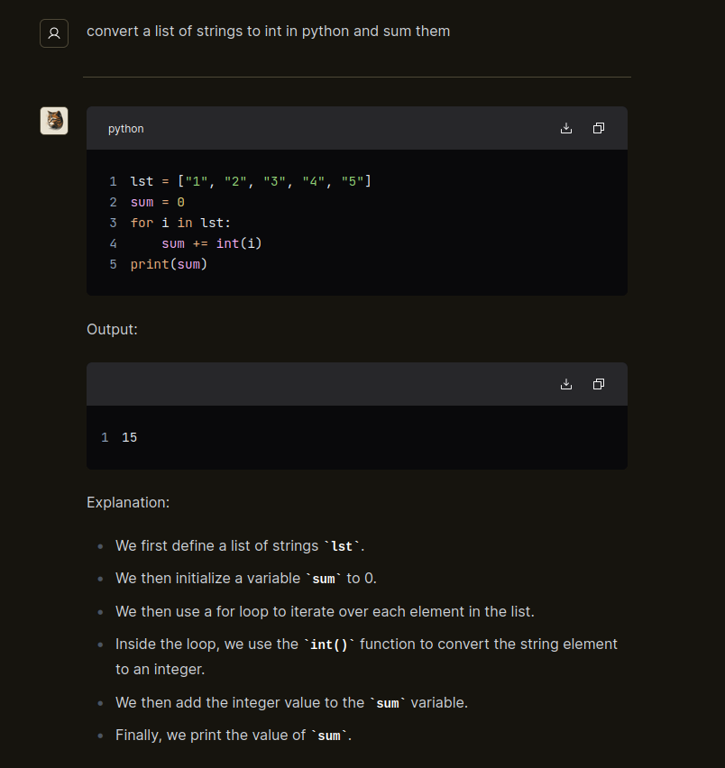

For those using (compatible) AMD graphics cards, you can now run Tabby locally with GPU acceleration using AMD's ROCm toolkit.

Currently, Tabby with ROCm is only supported on Linux, and can only be run directly from a compiled binary. In the future, Tabby will be able to run with ROCm on Windows, and we will distribute a Docker container capable of running with ROCm on any platform.

Before starting, please make sure you are on a supported system and have ROCm installed. The AMD website [details how to install it](https://rocm.docs.amd.com/projects/install-on-linux/en/latest/tutorial/install-overview.html), find the instructions for your given platform. Shown below is a successful installation of ROCm packages on Arch Linux.



Once you have installed ROCm, you can [download the precompiled binary for Tabby](https://github.com/TabbyML/tabby/releases/download/nightly/tabby_x86_64-manylinux2014-rocm57) with ROCm, or you can [compile it yourself](https://github.com/TabbyML/tabby/blob/main/CONTRIBUTING.md#local-setup). If compiling yourself, make sure to use the flag `--features rocm` to enable it. ROCm is currently supported in Tabby's nightly builds only, but will be stable with 0.8.8.

Once you have a compiled binary, you can run it with this command:

```
./tabby serve --model TabbyML/StarCoder-1B --device rocm
```

If the command is used correctly and the environment is configured properly, you should see command output similar to the following:



And enjoy GPU-accelerated code completions! This should be considerably faster than with CPU, and you can also try GPU-accelerated chat sessions:

```
./tabby serve --chat-model TabbyML/WizardCoder-3B --device rocm --webserver
```


