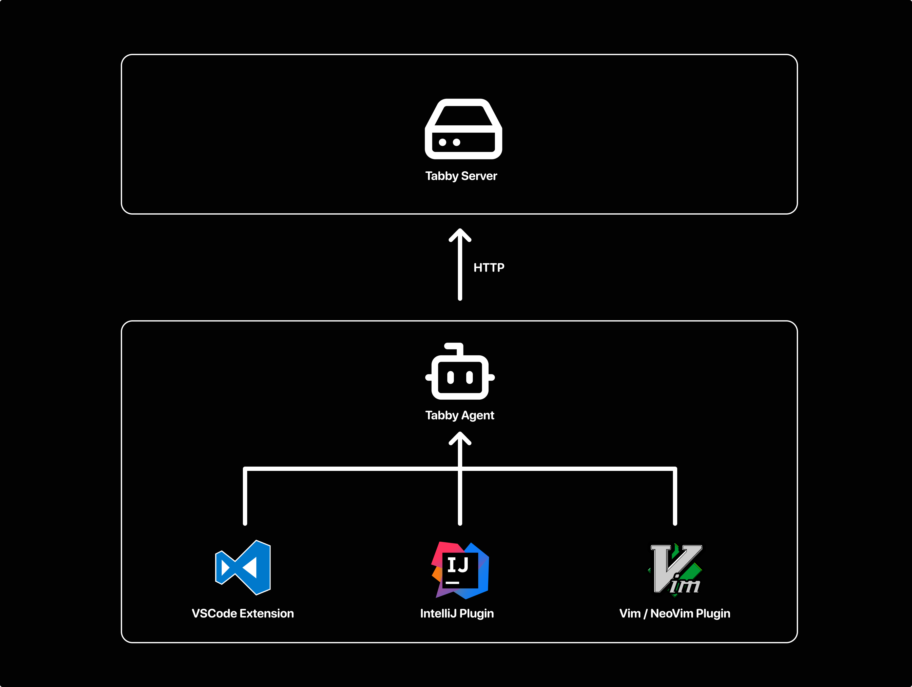
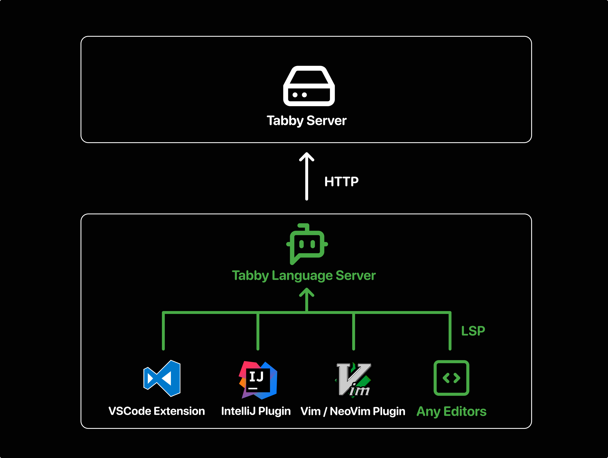
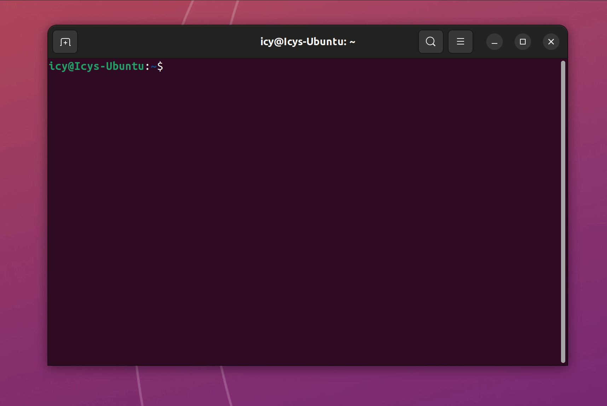

I am excited to announce that [Tabby Agent](https://github.com/tabbyml/tabby/tree/main/clients/tabby-agent/) now supports running as a [language server](https://microsoft.github.io/language-server-protocol/). This new feature allows you to enhance your code completion experience with Tabby in various text editors.

## What is Tabby Agent

[Tabby Agent](https://github.com/tabbyml/tabby/tree/main/clients/tabby-agent/) is a Node.js package that communicates with the Tabby server and implements several useful features for code completion, such as:

- **Debouncing**: Tabby Agent handles code completion requests by implementing an appropriate debouncing mechanism. This ensures that requests are not sent too frequently, reducing server load and improving performance, as the automatic inline code completion often listens for text input which can be very frequent.
- **Caching**: To prevent redundant completion requests, KV caching is implemented in Tabby Agent. When a completion is dismissed but needs to be requested again at the same location, the cached content is used directly. Cached completions are also matched when the prefix of a request aligns with a previously cached completion, eliminating the need for additional server requests. This is especially useful when the user types the same text with the ghost text suggestions.
- **Post-processing**: Tabby Agent enhances the completion results through post-processing. Tabby Agent filters out low-quality completions, improving the overall user experience by removing duplicate suggestions. Additionally, it limits the length of suggestions to the focused scope. This helps users focus on the most relevant suggestions.

These features were initially developed as part of the [Tabby VSCode extension](https://github.com/tabbyml/tabby/tree/main/clients/vscode/). However, we wanted to reuse this common client code logic and avoid reimplementing it for other text editors. As a result, Tabby Agent was created as a standalone Node.js package that can be used by other editors to communicate with Tabby.



## Why Language Server

Tabby Agent previously utilized a customized protocol based on JSON Lines, initially designed for compatibility with VIM's JSON mode channel. However, this protocol was not widely used, which increased the difficulty of integrating Tabby Agent with different editors. By adopting a more universal protocol, we can offer a more flexible and streamlined experience in creating Tabby plugins for various editors.

The [Language Server Protocol](https://microsoft.github.io/language-server-protocol/) defines a standardized protocol for communication between a language server and its clients. It provides methods that can be used to implement a wide range of features, including code completion.



Running Tabby as Language Server will provides code completion functionality using the standard `textDocument/completion` protocol. It can suggest code completions based on the context of the code, whether it's a line or a block, rather than just a single word.

I'm also looking forward to the proposed `textDocument/inlineCompletion` feature in the upcoming version 3.18 of the LSP Specification. It will provide better support for multi-line code completions. Stay tuned for more updates on this topic in the future!

## Running Tabby as a Language Server

To run Tabby as a language server, follow these steps:
1. Set up your Tabby server by following  [this guide](https://tabby.tabbyml.com/docs/installation/).
2. Make sure you have [Node.js](https://nodejs.org/) version 18 or above installed on your system.
3. Run the following command in your terminal:
    ```bash
    npx tabby-agent --lsp --stdio
    ```
    Follow the instructions displayed in the console. Once the installation is complete, the Tabby agent will start listening for requests on StdIO. If there are no error messages, you can assume that the Tabby Agent script is running correctly. You can stop it by pressing `Ctrl+C`.
    
4. You can configure the agent's settings by editing the config file located at `~/.tabby-client/agent/config.toml`. If your Tabby server uses a different port or requires authentication, modify these settings accordingly:
    ```toml
    [server]
    endpoint = "http://127.0.0.1:8080" # Replace with your server's endpoint
    token = "your_token"
    ```
    For more details on configuration options, refer to [this documentation](https://tabby.tabbyml.com/docs/extensions/configurations).

## Connect Your Editor to Tabby

Most text editors support built-in LSP clients or popular LSP client plugins, making it easy to connect them to the Tabby agent language server. Let's take NeoVim and [coc.nvim](https://github.com/neoclide/coc.nvim) as an example to show you how to configure your editor to connect to Tabby.

1. Install [coc.nvim](https://github.com/neoclide/coc.nvim) by following the [guide](https://github.com/neoclide/coc.nvim?tab=readme-ov-file#quick-start)
2. Start NeoVim, and use the ``:CocConfig`` command to open the configuration file. Add the following configuration:
    ```json
    {
      "languageserver": {
        "tabby-agent": {
          "command": "npx",
          "args": ["tabby-agent", "--lsp", "--stdio"],
          "filetypes": ["*"]
        }
      }
    }
    ```
    The "filetypes": ["*"] setting enables Tabby for all filetypes. You can modify it according to your needs.

3. Save the configuration file, and restart NeoVim. 
4. Open a file and start typing code to see code completion suggestions from Tabby.


For more examples of connecting Tabby to other editors, refer to the [Tabby Agent documentation](https://github.com/tabbyml/tabby/tree/main/clients/tabby-agent/). If you have configurations for your favorite editors that you'd like to share, feel free to submit a pull request!

## Create a Plugin for a New Editor

In the previous examples, Tabby completions are displayed in the dropdown completion list. However, this method may not be very convenient for displaying multi-line code completions. As most LSP clients do not yet support [inline completion](https://microsoft.github.io/language-server-protocol/specifications/lsp/3.18/specification/#textDocument_inlineCompletion), you may want to create a plugin for an editor that provides inline completion. To demonstrate how to communicate with Tabby via LSP, we have provided an example project [here](https://github.com/tabbyml/tabby/tree/main/clients/example-vscode-lsp).

Please note that language server support is still in its early stages, and your feedback will be invaluable in making it even better. If you have any ideas or suggestions, feel free to create an issue or join our Slack community.

Happy coding with Tabby!
