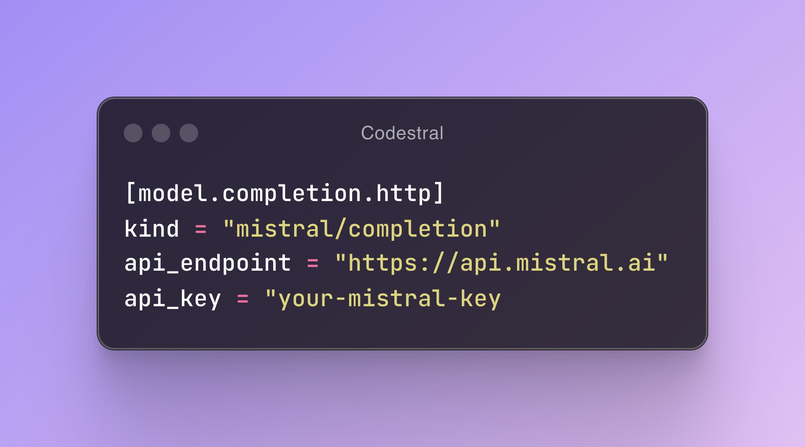

import CodestralVideoUrl from './tabby_codestral.mp4'

# Introducing the Codestral Integration in Tabby

We are excited to share the integration of ***Codestral*** model into Tabby! 
Codestral has demonstrated exceptional performance across various coding tasks, and we are delighted to support our users in both self-hosting and accessing Codestral through its cloud API. 
This addition aims to enhance your coding experience with precision and efficiency, setting a new standard for AI-enhanced developer experience.

<video autoplay muted controls src={CodestralVideoUrl} type="video/mp4" className='w-full md:w-[620px]'/>

## What's great about Codestral?

Compared to other coding LLMs, Codestral stands out with its single model that supports both instruction-following and fill-in-the-middle compatibility. 
This is achieved by fine-tuning the base model on two data sets simultaneously. 
This dual fine-tuning strategy allows the same model to perform excellently in both code completion and conversational tasks, greatly simplifying the model deployment stack. 
This highlights an important direction we're extremely excited about from an application perspective, especially in on-prem/byoc use cases.

Besides, Codestral is trained on a diverse dataset of **80+ programming languages**, ensuring a high-quality experience for developers working with a wide range of languages.

## Get started with Codestral in Tabby

### Self-hosting Codestral

Codestral-22B is available for both Tabby completion and chat models [link](https://tabby.tabbyml.com/docs/models/). 
Please follow [Tabby Installation](https://tabby.tabbyml.com/docs/quick-start/installation/) to host Tabby and set `--model Codestral-22B --chat-model Codestral-22B`.

:::warning
Users need to respect the [Mistral AI Non-Production License (MNPL)](https://mistral.ai/news/mistral-ai-non-production-license-mnpl/) when using Codestral model.
This license allows developers to use the model for non-commercial purposes and to support research work. For other production use cases, a Mistral commercial license is required.
:::

### Access via Mistal AI API

Tabby also supports connecting to Mistral's API Platform. To use Codestral via Mistral's API, you need to first sign up for an API key from [Mistral AI](https://mistral.ai/). 
Then in Tabby, set your model configuration as below in `~/.tabby/config.toml` file ([see more](https://tabby.tabbyml.com/docs/administration/model/#mistral--codestral)).

